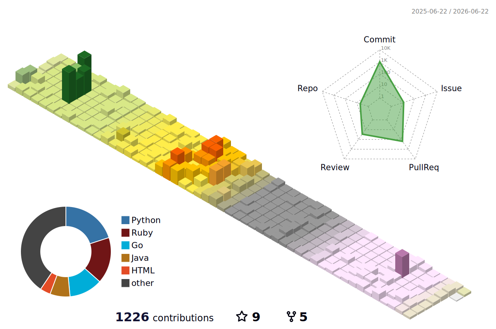

<div align="center">
  
  <picture>
    <source
      media="(prefers-color-scheme: dark)"
      srcset="https://typograssy.deno.dev/api?text=Hello%20World!!%20&bg=0d1116&l0=151b23&frame=ffffff&speed=100&comment="
    />
    <source
      media="(prefers-color-scheme: light)"
      srcset="https://typograssy.deno.dev/api?text=Hello%20World!!%20&bg=ffffff&l0=cccccc&frame=000000&speed=100&comment="
    />
    
  </picture>
</div>

```python
s='''b=__import__('binascii'); exec(b.unhexlify('696d706f72742077656262726f777365722c2074696d650a0a7
072696e7428225c6e22202b2022e4bb96e4baba        e381aee4bd9ce68890e38197e3819fe382b3e383bce38389e3829
2e5ae9fe8a18ce38199e3828be381aae38293               e38          1a6e382bbe382ade383a5e383aae38386e3
82a3e6848fe8ad98e4bd8ee38184e381aae                                 3818122202b20225c6e22290a0a74696
d652e736c6565702835290a0a75726c31                                     203d202268747470733a2f2f777777
2e696e7374616772616d2e636f6d2f3                                        1302e72796f2e31322f220a75726c
32203d202268747470733a2f2f782e                                          636f6d2f58785f785f52594f5f78
5f7858220a75726c33203d2022687                                             47470733a2f2f6174636f64657
22e6a702f75736572732f58785f                                                52594f5f7858220a75726c342
03d202268747470733a2f2f676                                                  9746875622e636f6d2f58782
d52594f2d7858220a0a0a7765                                                    6262726f777365722e6f706
56e2875726c31290a7765626                                                      2726f777365722e6f70656
e2875726c32290a776562627                                                       26f777365722e6f70656e
2875726c33290a776562627                                                         26f777365722e6f70656
e2875726c34290a0a70726                                                           96e7428225c6e22202b
2022e585a8e983a8e3839                              5e382a9e383                   ade383bce38197e381a
6e3818fe3828ce38288e                            381aaefbc8122202b                 20225c6e22290a'));
_="ef9426dcf08d19c2                          5214048f82866855fd64c                 3966cb7af5fe68a6d
0e34536b866a733a4a7                         7b81926954b9ef3fbc0d440                05a54932bd9af5984
9a5a36967c0c6169ae                         6a5a7d5a4e836adb931f3f73d8               975f377ff6ea6b19
acd0195c40ebfa322                         c243325a51778ba2cf49a7db8d7a              7fff6499cdaf0a93
44b3de4bd61829dc6                       a203f7ce45987c53377cb0bbcef7352              1928b77f95f8560
dd06075e1b08435d                       b084e6919ca22631d35cc19ee161b3c8d             d6e09d7141320c7
54036aa051e5530                        b505c6e272bfa34c9c732db9f5a16e55e              ec2f0e68c1cc81
4616560b863ee6d                       7a6615e1cae968c9905606df1bd65fed0a7              48880072f0e61
882cbcd14e5f24                       c3379a0873a5cd7af25e7ad74143229a45a50             348695297e19d
4e2b2f74cdee1                       60047e996c651c5e0636cb04052c15218474856             c682db8d936d
e1ea2f00115f4                      3996ae11d537e3b032676cf79bc6e0a84efa4a838            a244db388058
b8d06da838e3                       e4c189ebadad098a7afe6500f4e51831a321e3a41e            555fc7184f4
f2cd3301d36                       93f9f8e862c58841e8d0d1c5d0b2069bd05bf1a0c44            67b46fb1721
25309b72784                       ee951ed24425cc70087f2cc201273ea1ee3dad160a35            1efc0c34e4
d743d586d9                        f50cb158db7c5e315c7bb478ebadc4166d432c96a0c1            e66b017dd1
be61f91a8b                       b7604892605ba76bcbcd4e24f67117fcbf78bd8e690722            709971b73
d92cb4e1b                       3f4b80c1ad4c56a77a12234ec285b67a09b6ad212dfa7c8            a69ecf5a1
7126058cb                      b8f07916013556dabd12c4799306ef15e8292f43cdfb926b5            1b30c094
53b55e3c                     621586fd4e651ca94f625c3cb27d6f235e80929f587a018bf9e            83c78461
156d247b                    5225d16d70a559afb10bc9bf80b0c9755767e8cbd0d8ae83b035             64f7c3e
6c6337a6                    3e39c21740722f1e9826a65f93e364b03a301653211635e8c3f8             275d1a2
d39274e                     7768e096dab88d2b21ccbb15c02163e3a5a84f66638f5f9b5e09             4cbcb24
a911be0                    d9b39f75ef7ba6c1282fcb1a4ac35332e986f33bb80310bb27e81             aa37fcc
21f8a4b                    4c50f2ee7c1a3ad093cd49853e243ca17936a4ea0c5d84549ea385             a0185f
f062b8                    82ef505b9033fd90f48b27647783c2f05ff924ad 86ebce0a03ffa              c263fa
41d090                       16663416c45d6c6a3a9eb515c72a969cb3              0801             583b8a
fabd46                             0e741260f20dfc1226103538900            be59  a             9f4e2f
2fb796                                  c2c23bfe02f57dcfe305ca       8026a1cca9 b              1ba7e
65ccf2                                    c03548269b13980b2e0      02ca24348ce3e4              190a3
28b979                                    8b21098480c20f62dc5031402823d6464544d880             1427d
ab7d40                    e               7d7e772556d99e5e4acc32cca0d14b32288f6aaf             4fcc9
6980f1                  cede3961af       91eded512c0a630371e5cc88a0a02937fdef0f533             2d805
358bba                 88fbce5ed99c8 1c046dc216e4589eb991d9219f 2d19874822b66ffc5b2            92cd3
88eb45                7769d97cbbfe052df9be6dcf5774fe0dcf6ce9ec00eeb8e090cf8c9fb6377            38b50
f647e3                21bd7da6ebc4d66    caf41a5a2d62a094ba  bd9       f4528d7ed186b           683fe
ebbd45                fee0d43d85       4   44641dc64af9c451               6ba235b9b6            43d1
b8e25d                8d13e80               51605f4db3e56a                 2d6893fd9            bbc7
3ec980               d52f44                 49188ba682d2f6           3a     dee777d1f           ff7d
90669b               a39ce     b           14365baa72222332          21a be5c84e80741           6f14
811f28              3841b     d6           7685b68eacc6f0e           3c02981541706196           2332
2df0f1              11c64c66598a           810361740844923fa 6a8dd8ee0b7cf041d8281f0f          089e3
5dc3c2              39787f15179535    1  36a2cc05a1d16279eb7ac92be86489a4f5e7d8eab66c2         65010
342b3e             b8d85370234e0669e64   efbaabfeab69ef4de4e378b6dccde8392dbf45aacd6b1         30058
205c49             7c5ba0763a04d14589   1bf0d321e9c48123c7031f9847b055ec58a824e5c902ab         a9a2f
97edbe3            ccbe74dc87c9709fc2944c3d516c1a594ff67e188a22e3a8a452b671334b95dc320        b1ff47
963685e           41e9a54b77351a53d0362a3a22d7d58e3448404a4249594d38edaf868957a7fef4dc       8824cd8
c2f161d2          5bf57fca2af741b7064397ea41f2162d554bbf7798e5a2b1b621035b4d5ba036ff88      3c4568c6
62dbb74f          3d016f9072cdaf86e7e3fc0caaa583d01de84b5032878f5d8d834ebb5ef1074d6c25     c90b21e2b
9a35e6a34         81028feab5f3676404f570bb35a5f5f66d43d336ba3d01a0b417406feed49cd9cc25    4d2fa6944d
8118bc5e8e       18e0c9bec85b4649ea6f232e48f3073acb935c72faa95703dbd4beed838b853e70e9d   9a89f92428b
a417d3270131     86223c2c4bb5b9ec30d8178d962078cbfc455292a542190235d6461c45b1df0bb9848   d2d17f797c3
8730d663e085     e9b95f3d4587ec3011f73d6886a934f3f951191ecfc207f087d6ccdf3024f234a0bdb  cb5b57be53a9
fc43aceaff160     cbb543be5665ae589b4958d1e65770fcd19529e346a607dadb259c91fb456adb2fd9  68302fd797e6
0b9b408fbb45d3    71549fb45125690468c255450f205862d650f8ff5ecc75eed16f16cd740d543df2f6  d1686397b43b
450c3ec086566e    07146c45380b758cf5c25edabd240135e5ac7234ccb984e4611a61af98370ab6378c  a8326f8a7771
13ca4680bb71b90   e6e3c638b08ce24fe750662cec1859102027ae2937f24bc0865cedcd22e57d53e974  94abfa33d0ad
4752d7dbbb383ab5  796a73595fa72454731b03735677961fcd13bf2f51655985384eb7d9908e152ba9996c9fcb4c44ae38
f9cb09b9d6367b06  8d584ede516b6ea9d4620afebb507b7e95e3dc8b78379ccff77cfea339a7c281fc4bd0b703d14754c8
eece4094b7cf124e6 20f9585bf540cde1fb7324288a97a36dd9b9ae95367558b5f32c169762fb93060bd400ba5789e30959
7436b49f555b1d133936efa71540ddbeb58374260b11f  1b2ad9b91 edc79f63ea365a0033b65d186ca94712b89c2bfd5aa
8f923dbcb54b0eafe11f5d003c5b8942dc5d5aca8e9a       05d     7d4035d781550dd3f0d4d426f5d75db571106db34
e4f31e05d98632a0d3b9ce9d4a99c5a645cf42bf9c3                90eac56e0ac26298c68afe8ff8e9191dedaac7627
f732a4f9046a8969c96f96cd9329c21087f7989349ec  0a        632238b7017a8f70100740e89acd831051b50c2b56a7
3e1b0e63d35c6cf39dee2376021e81d3a51f2a20b004163656c e24e2797eecf92576ac25c8c16e9df4114356ab84664af68
96a86e5e639a4900bcea875f4da298c701b5c34b528fd98d2a946f41362dd9b7f4e608f63cfc9f1f3392da37e8f883e1f780
8e84f5bff96b3d02d5828343ab2eb135c0ab7eed679558ed6b59d0f3645578367cb81fd68ad37b60cb0e87aee96ff084f4f7
49b2cd9edc744b92d0a3ffe9dddd5c5df0720cfe72b68ed95d9b86902d8b740a65a34e5184ed9fda1d8bce1dbdcf1ac2f65b
b3a5e99f40265d802ae77ee0e41ed63ea1f02fd338f0334143729e20a2c746ec7f3e9fe0a8663a3be09cb7259c8479b3a433
09456c5ac52f8567cb0ff362b270d228533d104710818e1b1afdc500ef0a3ef0c5b981834996c9a106cd8c81f1acafedc080
e9bb37a9b48ef7d0f947e9474dbb82fa95add7083e096e55fe0f745aca3101da3533bcdab49382759d8f272c44c109ebb43a
5cd1dfb52172b8f467d80023ae41456cc8d5379086d35295 b31abe1418  47540fc0f26f4bbb3a94e3645bb8e9ff7c9a969
d85c25ee653b400ea45f62cc2af00890c98d38e011  ce3a        6e         de798440aaa5a14c011eaa4766c22b612
2ef401a338d8b7d4fb537331560810d7ac5c4                               1f96e243c45cf23d9a1f5995b2e7465e
d3f32e166d079649984837f6f1d6758a6a722                      db78fb   de54db9d30598200d5696a749dacef42
dcfd0b7962a951045645cb36a5c10b6315112     4c        58f7308deaf410 0f80e8435060029113cddef380964ca95
90c2d61167c3712c6cdbfb289e6f7fd8fd6d3  96004cca02086e9b1d750488afb661006d344a1e3004b494357b127786425
a5519d74e93cda95deeff04c758d1fc16a416d131e337d06e6153a41d07144d67c570bbaa888482303c283aafbd66b68b343
65dcea54af3fc2434e077957d3ee992b5a1826b868f809e83bd8d4eaf12f36edc3cf35c69c69a8a3c6b187d3fa0fcfd3aaa1
181972217a44e49d40a529e90b0a3affc70f6e558c2216734a3b6bee8af076bd26f64a06d581b88a9b73a3b8ca88f57f754c
6a5c71fbcd1e74a174062ba24f8fcd0d75a7a2e957ca7716bc6ae  34ee83da3b1fe3d1f847ad6a90b0c981c64ef84be4d8f
7ff8cb9914e0a13929d92cb4eae401f6f8c9c44799622c05b8     2c94910b32c5cb32ae1a46f4b3b3d61e09dbbb010302c
07f9de4fcb59227c0f639e5bf6fd3cca341be0bf5abc9a60a3    a13b43e59ff63c61aa121bd02767290092eb118bcb0bf8
2982d2d04576841f9e43376e2445fc5118185015061b8a39c06867785ccccd962ab722cdaceb398b00fd7932fa9cf0f8b8a1
66d057872594a7be380729845e6db0d789865a900369593f9306b2ff0d3f44a52b46acf9eb61e5f5e4b6079f53329b3953be
089af584d68a80076ef26e52dbdc5e83e0a3b4966ddf22d044e99c73a762e43aa8d657ca7d350727f96c3e87d8a074e41627
327444f766210d8c8a25022fa9f0ef9f3e68b0e4eb31a5a9442b5987a299d4aa1f285d8d35e1c3cb58377a7c163b49c6ffa8
8e6ff32a082e3aafddf29b526bee2ce6496164f555a8bd2082cc07730c4c46d9b43d47ddd3ad58422b05b622e2b0c38d7c04
85a03c9f2a0b225f23e37f289f838c4413e7794b14a87e50a3f2c643e0fb3fbb930a715a89ab959f94b910a1fc06cde18091
698503b1cf6e715e73c7488575ad94fbe7210bc57cc0f5f57fa7e0b5f9cc574a4539b7edd53a3df8035fa3028caff46e6966
843f7db75f967337d33200a8f5b0a6d4ca42941f55ac3c3838e31910c19e7076f60b5a7eb79bb7a7f1902433701f8121d699
fcbc8057075008b74a1e6e8a4216d342ef3e3725980e69f5c9326399c4da930116e12b39cbe348be56025a0db34b2f7b5919
8c0ce0c6c8fc155af39c498655fefd77a86dcec171c21ccfc43b378726bd367819b5db25468bec36744268d48fbd17e0b023
94447e4c6962a950915b9106e78cb911be975629756dff8f73309065673578dfb1f69cf2c983c34316650ec42246a8564b07
f34f9c9d7b387c31b7b2607e6e825b254efa7a6d02cd5cff72b7161f4643608d78184c0c86f2148eaa23c037f2680a239618
c7222d8c2cc888d0e4044bca697ef0658debfb4b31b9971d8a4a696e 308ad25fd1e7fe43dc46f83bcab83bd0269d3c884ef
bbe3cdf73ba099cd5ad952ddc aa891b3c6342a608b4d87736         40c0ca1af7a77f608922 cb30df13a2e3bfe407cb
6932e4470f59528a3873eac2  f4049e3c4768804    96b           9a2d1a67bf1df14c45c9 42c847609ae492d758f5
22ef6d3ff6df4fd5f80854ea  a43aaed052259a2c                    d4c2686f5d6e7e2dd   af1ae50c45f6b9a0ac
ef35533d796440ca9409600   35c33502b5ea71803                   88633ea3384fd9027    2ef6af43004186589
53b596e304f4cf10f6f3f     641f920569adbd11cb                  344492c460a21e586      9355682388a6cb4
190e759d4085ec44cdba      b01a7cd8fe 1ef5c5ab6               b0402e78defe15e5b6        d6e255a2c61f1
1e591c737c713e5d501       217cd010f149ed8e1199df           e0461b9ca293c546ec14          a607998126c
39746fa420a32022f         3a8b73bf0f7e b4da4da9569f     c3dc0922eea1c57bc4f732              eee81f65
be8c97058047e5c           9dc0825fec76c2  045a8 9f876  29b80b38a9eb587dcb9ce17                 97428
5e9f2ff357b6a             b935007095e1f739 3517d33db684c 23769812e576a68e5300a                   735
08b5da0c134               a56b780a59859807  111e865ee7653443fe55c889c125859adc                     9
f39dc4d2                  bf44cf485ce087b489 87855dd03bf4340c9f9d57408a44ba3e6                      
75e49a                     012c57557bc2c57ec9  c7c4dff573b1770eabc524ba7327639                      
8434                       eff6a7491098037177e7 607a3b25a29d7805edc43e6437ff32                      
9c                         401ff92ecef099828e49e27 6cd61fc88d55b973278bc4ad4"                       
''';exec(''.join(s.split()));
```

<div align="center">

  <p>I'm Ryo. I'm currently a fourth-year student at Kyoto Sangyo University.</p>
  <p> My Major is Information science and engineering, and my research focuses on accelerating ORAM (<a href="https://en.wikipedia.org/wiki/Oblivious_RAM" title="about Oblivious RAM">Oblivious RAM</a>)</p>
  <p>You are the
    <picture>
    <source
      media="(prefers-color-scheme: dark)"
      srcset="https://komarev.com/ghpvc/?username=Xx-RYO-xX&label=&color=0d1116"
    />
    <source
      media="(prefers-color-scheme: light)"
      srcset="https://komarev.com/ghpvc/?username=Xx-RYO-xX&label=&color=lightgrey"
    />
    
  </picture>
  th visitor.</p>

</div>

## My Discord Status

<div align="center">
  <a href="https://discord.com/users/1092447499089879211">
    <picture>
      <source
        media="(prefers-color-scheme: dark)"
        srcset="https://lanyard.cnrad.dev/api/1092447499089879211?animated=true&showDisplayName=true&animatedDecoration=true&theme=dark&borderRadius=50px"
      />
      <source
        media="(prefers-color-scheme: light)"
        srcset="https://lanyard.cnrad.dev/api/1092447499089879211?animated=true&showDisplayName=true&animatedDecoration=true&theme=light&borderRadius=50px"
      />
      
    </picture>
  </a>
</div>


## Now Listening

<div align="center">
  <a href="https://spotify-github-profile.kittinanx.com/api/view?uid=31xz4l2kuofxqhmr7i3xmen5emla&redirect=true">
    <picture>
      <source
        media="(prefers-color-scheme: dark)"
        srcset="https://spotify-github-profile.kittinanx.com/api/view?uid=31xz4l2kuofxqhmr7i3xmen5emla&cover_image=true&theme=spotify-embed&show_offline=true&background_color=121212&interchange=false&profanity=false&hide_remaster=false&bar_color=53b14f&bar_color_cover=false&mode=dark"
      />
      <source
        media="(prefers-color-scheme: light)"
        srcset="https://spotify-github-profile.kittinanx.com/api/view?uid=31xz4l2kuofxqhmr7i3xmen5emla&cover_image=true&theme=spotify-embed&show_offline=true&background_color=121212&interchange=false&profanity=false&hide_remaster=false&bar_color=53b14f&bar_color_cover=false&mode=light"
      />
      
    </picture>
  </a>
</div>

## My Activity

<div align="center">

  <picture>
        <source media="(prefers-color-scheme: dark)"  srcset="output/metrics.base.svg" width="400" />
	<source media="(prefers-color-scheme: light)" srcset="output/metrics.base.svg" width="400" />
	
  </picture>

  <picture>
   	<source media="(prefers-color-scheme: dark)"  srcset="output/details.svg" width="400" />
	<source media="(prefers-color-scheme: light)" srcset="output/details.svg" width="400" />
	
  </picture>
  
  <picture>
	  <source media="(prefers-color-scheme: dark)"  srcset="profile-3d-contrib/profile-night-rainbow.svg" width="700" />
	  <source media="(prefers-color-scheme: light)" srcset="profile-3d-contrib/profile-season-animate.svg" width="700" />
	  
	</picture>

  
  
</div>

<!-- <div align="center">
  <a href="https://atcoder.jp/users/Xx_RYO_xX?contestType=algo">
    <picture>
        <source
          media="(prefers-color-scheme: dark)"
          srcset="https://atcoder-readme-stats.vercel.app/stats/Xx_RYO_xX?theme=darcula&show_icons=true&show_history=5&width=450"
        />
        <source
          media="(prefers-color-scheme: light)"
          srcset="https://atcoder-readme-stats.vercel.app/stats/Xx_RYO_xX?show_icons=true&show_history=5&width=450"
        />
        
    </picture>
  </a>
</div> -->
<!--
<div align="center">
  <a href="https://atcoder.jp/users/Xx_RYO_xX?contestType=heuristic">
    
  </a>
</div>
-->

## My skills, Environments and more
<div align="center">
  
  <a href="https://learn.microsoft.com/ja-jp/cpp/c-language/c-language-reference?view=msvc-170" title="C Language Reference">
    
  </a>
  <a href="https://www.python.org/" title="Python Official Site">
    
  </a>
  <a href="https://www.java.com/" title="Java Official Site">
    
  </a>
  <a href="https://developer.mozilla.org/docs/Web/HTML" title="HTML Docs">
    
  </a>
  <a href="https://developer.mozilla.org/docs/Web/CSS" title="CSS Docs">
    
  </a>
  <a href="https://developer.mozilla.org/docs/Web/JavaScript" title="JavaScript Docs">
    
  </a>
  <a href="https://www.markdownguide.org/" title="Markdown Guide">
    
  </a>

</div>

<div align="center">

  <a href="https://git-scm.com/" title="Git">
    
  </a>
  <a href="https://github.com/" title="GitHub">
    
  </a>
  <a href="https://gitlab.com/" title="GitLab">
    
  </a>
  <a href="https://www.docker.com/" title="Docker">
    
  </a>
  <a href="https://code.visualstudio.com/" title="VSCode">
    
  </a>
  <a href="https://www.jetbrains.com/pycharm/" title="PyCharm">
    
  </a>
  <a href="https://www.jetbrains.com/idea/" title="IntelliJ IDEA">
    
  </a>
  <a href="https://www.jetbrains.com/webstorm/" title="WebStorm">
    
  </a>
  <a href="https://www.mathworks.com/products/matlab.html" title="MATLAB">
    
  </a>

</div>

<div align="center">

  <a href="https://twitter.com/Xx_x_RYO_x_xX" title="TwitterID: Xx_x_RYO_x_xX">
    
  </a>
  <a href="https://discord.com/" title="DiscordID: ryo.inc">
    
  </a>
  <a href="mailto:ryo.na.na.ryo.na@gmail.com" title="MailAddress: ryo.na.na.ryo.na@gmail.com">
    
  </a>
  <a href="https://www.instagram.com/10.ryo.12/" title="InstagramID: 10.ryo.12">
    
  </a>

</div>

</div>


<picture>
  <source media="(prefers-color-scheme: dark)" srcset="https://raw.githubusercontent.com/ryonakagawa-1012/ryonakagawa-1012/output/github-contribution-grid-snake-dark.svg" />
  <source media="(prefers-color-scheme: light)" srcset="https://raw.githubusercontent.com/ryonakagawa-1012/ryonakagawa-1012/output/github-contribution-grid-snake.svg" />
  
</picture>

## My Portfolio

| 作品名                                                 | 概要               | 使用技術 | 
| ------------------------------------------------------ | ------------------ | -------- | 
| [Othello](https://github.com/ryonakagawa-1012/Othello) | 個人開発<br>8*8 のオセロゲーム | C | 
|  [Visualization_Sort_Algorithm](https://github.com/ryonakagawa-1012/Visualization_Sort_Algorithm) | 個人開発<br>様々なソートアルゴリズムをグラフィックライブラリを用いて可視化 | C |
| [sorcery-assemble](https://github.com/c-a-c/sorcery-assemble) | チーム開発<br>マインクラフトで魔法が使えるアイテムを追加するプラグイン | Java |
| [Competitive-Programming](https://github.com/ryonakagawa-1012/Competitive-Programming) | 競技プログラミングの提出コード、テンプレートなどを保存しているリポジトリ | Python |
| [KSDUPC 2024](https://ioor.connpass.com/event/324201/) | 京都産業大学と同志社大学の有志の学生が運営、作問したプログラミングコンテスト | |
| [TeraCoder2024](https://tcjudge.github.io/teaser-site/2024/) | 所属しているサークルIOORが運営、作問した京都産業大学で行った賞金付きのプログラミングコンテスト | |
| [Forest_Program](https://github.com/ryonakagawa-1012/Forest_Program) | チーム開発<br>MVCモデルで作成した、ファイル構造の樹状整列を可視化するアプリケーション | Java |
| [Forest_Document](https://github.com/ryonakagawa-1012/Forest_Document) | チーム開発<br>Forest_Programの基本設計、詳細設計、テスト結果などをHTMLでまとめたもの | HTML |
| [TeraCoder2025](https://tcjudge.github.io/teaser-site/2025/) | 所属しているサークルIOORが運営、作問した京都産業大学で行った賞金付きのプログラミングコンテスト | |
| [TeraCoder Judge System](https://tcjudge.kyoto-su.ac.jp) | 所属しているサークルIOORが開発、運営、保守しているプログラミングコンテスト用のオンラインジャッジシステム | セキュリティの観点から非公開 |

## 作問問題一覧

### [KSDUPC 2024](https://ioor.connpass.com/event/324201/)

*   [駅伝中継](https://mofecoder.com/contests/ksdupc_2024/tasks/ksdupc_2024_f)
    *   概要: KSDUPC 2024-F問題、想定解法はSortedlistを使う。優先度付きキューでも回答可能
    *   使用アルゴリズム、データ構造等: Sortedlist, 優先度付きキュー

### [TeraCoder2024](https://tcjudge.github.io/teaser-site/2024/)

*   [Welcome to Teracoder](https://mofecoder.com/contests/teracoder2024/tasks/teracoder2024_a)
    *   概要: TeraCoder2024-A問題、想定解法はfor文等でN回"TeraCoder"を出力する
*   [Only One Canpas](https://mofecoder.com/contests/teracoder2024/tasks/teracoder2024_d)
    *   概要: TeraCoder2024-D問題、想定解法は配列を使って解く
*   [Wreker Terako](https://mofecoder.com/contests/teracoder2024/tasks/teracoder2024_h)
    *   概要: TeraCoder2024-H問題、想定解法は3乗の和の公式を使う
*   [Say!Yes!Kyosan Beam](https://mofecoder.com/contests/teracoder2024/tasks/teracoder2024_k)
    *   概要: TeraCoder2024-K問題、想定解法は強連結成分分解を使う
    *   使用アルゴリズム、データ構造等: 強連結成分分解
*   [Word Chain Terako](https://mofecoder.com/contests/teracoder2024/tasks/teracoder2024_l)
    *   概要: TeraCoder2024-L問題、想定解法は問題文通りに実装する

### [TeraCoder2025](https://tcjudge.github.io/teaser-site/2025/)

*   [Expo Queue](https://tcjudge.kyoto-su.ac.jp/contests/teracoder2025/problems/expo-queue)
    *   概要: TeraCoder2025-F問題、想定解法はキューを用いる
    *   使用アルゴリズム、データ構造等: キュー
*   [Barn Owl Terako](https://tcjudge.kyoto-su.ac.jp/contests/teracoder2025/problems/barn-owl-terako)
    *   概要: TeraCoder2025-G問題、想定解法は1からNまでの最短経路をダイグストラ法で求める
    *   使用アルゴリズム、データ構造等: ダイクストラ法
*   [Bingo Game](https://tcjudge.kyoto-su.ac.jp/contests/teracoder2025/problems/bingo-game)
    *   概要: TeraCoder2025-I問題、想定解法は行・列・対角線に対して、開けられたマスの数をカウントする配列を用意して解く
*   [Kyosan Escalator](https://tcjudge.kyoto-su.ac.jp/contests/teracoder2025/problems/kyosan-escalator)
    *   概要: TeraCoder2025-L問題、想定解法はクラスカル法を用いる
    *   使用アルゴリズム、データ構造等: Union-Find, クラスカル法
